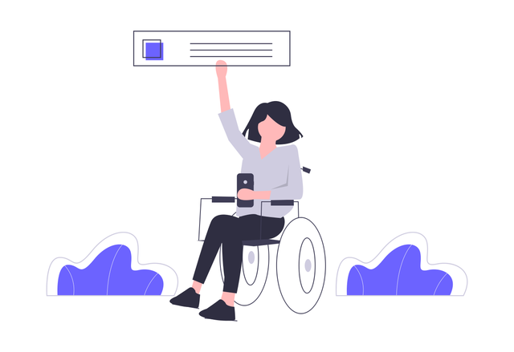

# 👩‍🦽 Sienna: Accessibility Widget for Websites

Sienna: accessibility widget for websites. easy to install, just copy and paste the plugin. Fast performance with lightweight plugin (~30kb).

## 🎉 Getting Started
[View Demo](https://accessibility-widget.pages.dev)

[Install the plugin quickly with just a copy and paste](https://accessibility-widget.pages.dev/#setup)

## 🚀 Features

✅ **Multilingual Support**: Supports multiple languages to ensure a seamless user experience for all users.

✅ **Dyslexia Font**:  Dyslexia font to make reading easier for dyslexic users.

✅ **Adjustable Font Size and Highlighting Text**: Users can easily adjust the font size and highlight text to their liking, making it easier to read content.

✅ **Bionic Reading**: Allows users to read content faster and more efficiently by highlighting parts of the words.

✅ **Color Adjustments, Contrast, Saturation, and Monochrome**: Allows users to customize the color scheme of your website, making it easier for them to read and navigate.

✅ **Reading Guide, Stop Animations, Hiding Images, and Big Cursor**: Helpful tools like a reading guide, the ability to stop animations, and a big cursor to make browsing your website easier for users with visual impairments.

✅ **Screen Reader**: Clicking or selecting text will read it out loud, making it easier for users with visual impairments to navigate your website.

✅ **Muting Audio**: Users can easily mute audio and video elements on your website, making it easier for them to focus on the content.

## 🐛 Known Issues

- The screen reader is disabled in Google Chrome as it would only read the selected text for 15 seconds, then stop. This is a known issue with Chrome and the `speechSynthesis` API.

## 📌 TODO

- Accessibility Profiles
- Voice Navigation
- Position of Button
- Inject Icon in code
- Support More Languages

## 🤝 Contributing
We welcome contributions from anyone who is interested in improving this. If you would like to contribute, please fork the repository and submit a pull request. ❤️

## 🎓 License
Sienna is released under the MIT License
